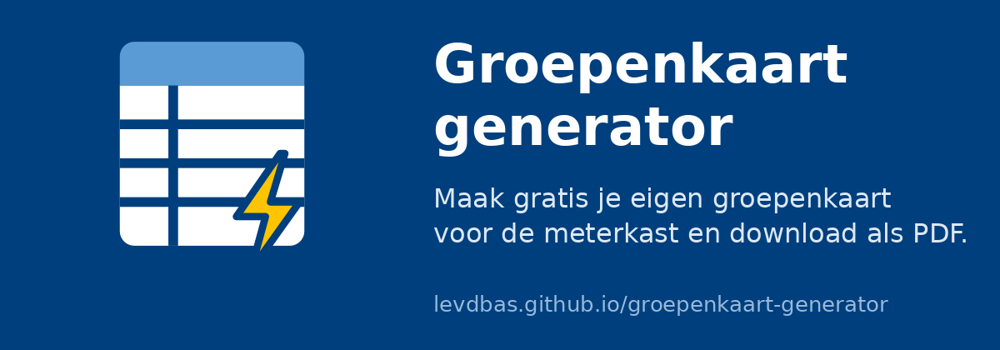

[](https://levdbas.github.io/groepenkaart-generator/)

# Groepenkaart generator

Een kleine webapp om een groepenkaart (groepenindeling) voor je meterkast of verdeelkast te maken en als PDF te downloaden of af te drukken. De app draait volledig in de browser.

**[➜ Open de Groepenkaart generator](https://levdbas.github.io/groepenkaart-generator/)**

## Functies

- Meerdere **kasten** toevoegen, elk met een nummer en een naam
- Per kast **groepen** toevoegen met een nummer, een omschrijving en een optionele opsomming van aansluitingen
- Kasten en groepen verplaatsen (↑ ↓) en verwijderen (✕)
- **Installatiewaarschuwingen** aanvinken voor zonnepanelen (PV-installatie), thuisbatterij en airco/warmtepomp. De geselecteerde waarschuwingen verschijnen als grote rode kaarten met pictogrammen op de eerste pagina, zowel in de PDF als bij afdrukken.
- **Aardlekschakelaars** (aardlekschakelaar: Residual Current Device, RCD): zet **Groepen koppelen aan Aardlekschakelaars** aan, voeg Aardlekschakelaars toe met een eigen code, naam en kleur, en koppel groepen eraan. In de PDF en bij afdrukken krijgt het groepnummer de kleur en code van de gekoppelde aardlekschakelaar, met een legenda per pagina.
- **Fasen**: zet **Fasen documenteren (3-faseninstallatie)** aan. Kies bij elke aardlekschakelaar 2 of 4 polen. Een 2-polige aardlekschakelaar heeft één te kiezen fase (L1, L2 of L3); gekoppelde groepen nemen die fase over. Een 4-polige aardlekschakelaar heeft alle drie de fasen; groepen hierop kiezen zelf één of meer fasen, net als groepen zonder koppeling. De fasen verschijnen in de PDF en bij afdrukken.
- **QR-code**: zet **QR-code toevoegen aan de PDF** aan (de bovenste optie) en de laatste pagina van de PDF krijgt een QR-code. Scannen opent de app met alle gegevens, zodat je de groepenkaart op een andere telefoon of computer kunt aanpassen. Zie [QR-code en deellink](#qr-code-en-deellink).
- **PDF downloaden**: één A4-pagina per kast, in de stijl van een standaard groepenkaart. Lege regels worden aangevuld tot 15 rijen, zodat je later nog met de hand kunt aanvullen.
- **Afdrukken** via de printfunctie van de browser, met dezelfde opmaak
- Automatisch **opslaan in de browser** (localStorage)
- **Exporteren en importeren** als JSON-bestand, voor een back-up of om op een andere computer verder te werken

De optie **Fasen** staat boven **Aardlekschakelaars**. Met faseregistratie aan worden groepen als ruimere invoerkaarten getoond, met de omschrijving naast het groepnummer, de aansluitingen op een eigen regel en de aardlekschakelaar- en fasekeuze op een aparte regel daaronder.

In de PDF en bij afdrukken krijgt de fasekolom een gekleurde onderrand binnen de cel: L1 bruin (`#8B4513`), L2 zwart (`#000000`) en L3 grijs (`#808080`). Bij meerdere actieve fasen wordt de rand in gelijke delen verdeeld. Niet gekozen fasen en lege aanvulregels krijgen geen gekleurde rand.

## Gebruik

1. Open de [web app](https://levdbas.github.io/groepenkaart-generator/) of [draai de app lokaal](#lokaal-draaien).
2. Klik onderaan de pagina op **+ Kast toevoegen** en vul een kastnummer en een naam in, bijvoorbeeld `1` en `Meterkast begane grond`.
3. Elke nieuwe kast begint automatisch met groep `1`. Klik op **+ Groep toevoegen** voor extra groepen. Het groepnummer wordt automatisch opgehoogd en kan worden aangepast, bijvoorbeeld naar `1a` of `F3`.
4. Vul per groep de omschrijving in, bijvoorbeeld `Keuken – wandcontactdozen aanrecht, vaatwasser`. Een groep heeft geen aparte naam meer: de omschrijving staat op de plek van de naam. Bij **Aansluitingen** kun je per regel een apparaat of aansluiting invullen. Lege regels worden genegeerd. De aansluitingen verschijnen als opsomming onder de omschrijving in de PDF en bij afdrukken.
5. Vink bij **Aanwezige installaties** aan welke installaties aanwezig zijn. De selectie geldt voor de hele installatie, niet per kast. Standaard is niets aangevinkt. Elke kaart vermeldt **LET OP!**, de aanwezige installatie en een bijbehorende waarschuwing. Voor een airco/warmtepomp luidt die: **Omvormer: condensatoren kunnen na uitschakelen nog spanning houden.**
6. Je groepen ook koppelen aan aardlekschakelaars? Vink dan **Groepen koppelen aan Aardlekschakelaars** aan en klik op **+ Aardlekschakelaar toevoegen**. Geef elke aardlekschakelaar een code (bijvoorbeeld `A1`), een naam en een kleur. Standaard krijgt `A1` oranje (`#ed8c01`), `A2` blauw (`#009fe3`), `A3` groen (`#95be1a`) en elke volgende aardlekschakelaar grijs (`#9e9e9e`); je kunt de kleur altijd aanpassen. Kies daarna per groep in de kolom **Aardlekschakelaar** bij welke aardlekschakelaar de groep hoort. De Aardlekschakelaars gelden voor de hele installatie en zijn niet aan een kast gebonden. Als je een aardlekschakelaar verwijdert, worden de gekoppelde groepen ontkoppeld. Zet je de optie uit, dan worden na bevestiging alle Aardlekschakelaars en koppelingen verwijderd.
7. Wil je dat de PDF een QR-code met alle gegevens bevat? Vink dan bovenaan **QR-code toevoegen aan de PDF** aan.
8. Klik op **PDF downloaden** voor een PDF-bestand, of op **Afdrukken** om direct te printen of via het printvenster als PDF op te slaan.

### QR-code en deellink

Met **QR-code toevoegen aan de PDF** komt onder de laatste tabel een QR-code van circa 5,5 cm met een korte uitleg. De QR-code bevat een link naar de app met alle gegevens van de groepenkaart in het deel na de `#`, bijvoorbeeld `https://levdbas.github.io/groepenkaart-generator/#data=…`. De gegevens zijn dezelfde als in het JSON-bestand (zonder `$schema`), gecomprimeerd met deflate en als base64url-tekst in de link gezet. Dit deel van een link gaat nooit naar een server.

Opent iemand zo'n link, dan valideert en migreert de app de gegevens net als bij **Importeren**, vraagt bevestiging als er al gegevens zijn, en haalt daarna de gegevens uit de adresbalk. Oude QR-codes blijven werken na een nieuwe schemaversie, omdat `schemaVersion` in de gegevens zit.

Een QR-code kan maximaal circa 2950 tekens bevatten. Dat is ruim voldoende voor een gewone groepenkaart (30 groepen blijven rond de 500 tekens). Past een kaart er niet in, dan toont de app een melding en maakt de PDF zonder QR-code; bewaar de gegevens dan met **Exporteren**. De QR-code is een momentopname: wijzig je de kaart daarna, dan komt de gedrukte code niet meer overeen. De optie geldt alleen voor de PDF, niet voor **Afdrukken**.

### Gegevens bewaren

Alles wat je invoert wordt automatisch opgeslagen in je browser. Wis je de browsergegevens of gebruik je een andere browser of computer, dan ben je de gegevens kwijt. Gebruik daarom **Exporteren** om een `groepenkaart.json` te bewaren. Met **Importeren** laad je dat bestand later weer in.

Ook de installatiewaarschuwingen worden opgeslagen en geëxporteerd. De mogelijke codes in `warnings` zijn `pv`, `ev`, `battery` en `heat-pump`. De `ev`-code blijft onderdeel van het bestandsformaat voor compatibiliteit, maar EV-laders zijn niet meer als waarschuwing beschikbaar in de app of op de groepenkaart. Oude bestanden zonder `warnings` blijven werken en worden zonder aangevinkte waarschuwingen geladen. Aardlekschakelaars staan in `rcds` (met `id`, `number`, `name` en een kleur als `#rrggbb`); `rcdEnabled` geeft aan of de koppeling aanstaat. Een groep verwijst met `rcdId` naar het `id` van een aardlekschakelaar, of heeft `null` als de groep niet gekoppeld is. `qrEnabled` geeft aan of de QR-code in de PDF aanstaat. **Alles wissen** verwijdert kasten, groepen, de geselecteerde waarschuwingen, de Aardlekschakelaars en de fase- en QR-instellingen.

Voorbeeld van een exportbestand:

```json
{
  "$schema": "https://raw.githubusercontent.com/Levdbas/groepenkaart-generator/main/schemas/groepenkaart-v4.schema.json",
  "schemaVersion": 4,
  "warnings": ["pv", "ev", "battery", "heat-pump"],
  "qrEnabled": true,
  "rcdEnabled": true,
  "phaseEnabled": true,
  "rcds": [
    {
      "id": "5eefe74d-12b8-40e6-825b-409e26c0b066",
      "number": "A1",
      "name": "Keuken en badkamer",
      "color": "#ed8c01",
      "amountOfPoles": 2,
      "phases": ["L1"]
    }
  ],
  "boxes": [
    {
      "number": "1",
      "name": "Meterkast begane grond",
      "groups": [
        {
          "number": "1",
          "description": "Keuken – wandcontactdozen aanrecht",
          "items": ["Vaatwasser", "Wandcontactdozen aanrecht"],
          "rcdId": "5eefe74d-12b8-40e6-825b-409e26c0b066",
          "phases": []
        },
        {
          "number": "2",
          "description": "Woonkamer – verlichting en wandcontactdozen",
          "rcdId": null,
          "phases": ["L2", "L3"]
        }
      ]
    }
  ]
}
```

### Schemaversies en migraties

JSON-exportbestanden en browseropslag bevatten `schemaVersion: 4`. Dit is de versie van het gegevensformaat, onafhankelijk van de appversie. De gedeelde gegevenstypen (`CardData`, `BoxData`, `GroupData`, `RcdData`, `PhaseCode` en `WarningCode`), validatie en migraties staan in [src/js/schema.js](src/js/schema.js).

Groepen kunnen optioneel `items` bevatten: een array van strings met de aansluitingen. Bestaande bestanden zonder dit veld blijven werken; de schemaversie blijft 4. Een leeg tekstveld wordt na bewerking opgeslagen als `items: []`.

`qrEnabled` is een verplichte boolean in versie 4 en geeft aan of de PDF een QR-code met alle gegevens krijgt. De instelling geldt voor de hele installatie en wordt met **Alles wissen** teruggezet naar `false`.

`phaseEnabled` is een verplichte boolean sinds versie 3 en geeft aan of faseregistratie voor een 3-faseninstallatie aanstaat. De instelling geldt voor de hele installatie en wordt met **Alles wissen** teruggezet naar `false`. Uitzetten verbergt de fasekeuze en de fasen in de PDF en bij afdrukken, maar bewaart de bestaande selecties.

Elke aardlekschakelaar heeft de verplichte velden `amountOfPoles` (2 of 4) en `phases` (een lijst met unieke codes `L1`, `L2`, `L3`). Een 2-polige aardlekschakelaar heeft maximaal één fase; een lege lijst betekent **Niet gekozen**. Een 4-polige aardlekschakelaar heeft altijd alle drie de fasen. Terugzetten van 4 naar 2 polen maakt de fasekeuze leeg, zodat je opnieuw een fase kiest.

Elke groep bewaart in het verplichte veld `phases` de eigen selectie (nul tot drie fasen). Zonder koppeling of bij een 4-polige aardlekschakelaar wordt deze selectie gebruikt. Bij een 2-polige aardlekschakelaar wordt alleen de fase van de aardlekschakelaar getoond; de eigen selectie blijft bewaard voor als je de groep later ontkoppelt of aan een 4-polige aardlekschakelaar koppelt. Een niet gekozen fase wordt ook in de PDF en bij afdrukken als **Niet gekozen** vermeld.

Het [JSON Schema voor versie 4](schemas/groepenkaart-v4.schema.json) is beschikbaar via [raw.githubusercontent.com](https://raw.githubusercontent.com/Levdbas/groepenkaart-generator/main/schemas/groepenkaart-v4.schema.json), zodat andere tools exportbestanden kunnen valideren. De schema's voor [versie 3](schemas/groepenkaart-v3.schema.json), [versie 2](schemas/groepenkaart-v2.schema.json) en [versie 1](schemas/groepenkaart-v1.schema.json) blijven ongewijzigd gepubliceerd. Elke export bevat `$schema` met de URL van de huidige versie; browseropslag bevat dit metadataveld niet. Het veld is optioneel voor import en externe validatie. De app gebruikt `schemaVersion` voor validatie en migraties en haalt geen schema op tijdens import. Versie 4 vereist `schemaVersion`, `warnings`, `qrEnabled`, `rcdEnabled`, `phaseEnabled`, `rcds` en `boxes`, per aardlekschakelaar `amountOfPoles` en `phases`, en per groep `number`, `description`, `rcdId` en `phases`. Een groep heeft sinds versie 3 geen `name` meer; kasten behouden hun `name`. Een `rcdId` moet naar een bestaande aardlekschakelaar verwijzen, en `rcds` moet leeg zijn als `rcdEnabled` uit staat. De persistente `id` van een aardlekschakelaar wordt wel opgeslagen; interne UI-ID's van kasten en groepen niet.

Bestanden zonder `schemaVersion` (of met versie `0`) zijn het oude formaat en worden automatisch gemigreerd. Ontbrekende waarschuwingen worden een lege lijst; de bestaande omzetting van numerieke velden naar tekst blijft behouden. Bij de migratie van versie 1 naar 2 staat de koppeling met Aardlekschakelaars uit, zonder Aardlekschakelaars, en krijgt elke groep `rcboId: null` (versie 1 en 2 gebruiken de veldnamen `rcboEnabled`, `rcbos` en `rcboId`, naar de oude term RCBO). Bij de migratie van versie 2 naar 3 blijven alle bestaande gegevens behouden: de velden worden hernoemd naar RCD (`rcboEnabled` wordt `rcdEnabled`, `rcbos` wordt `rcds` en `rcboId` van elke groep wordt `rcdId`, met dezelfde waarden en volgorde, en de oude velden verdwijnen), `phaseEnabled` wordt `false`, elke aardlekschakelaar krijgt `amountOfPoles: 2` en `phases: []`, en elke groep krijgt `phases: []`, dus niets staat vooraf op een fase. Daarnaast verdwijnt de `name` van elke groep: de naam wordt als voorvoegsel in de `description` gezet, gescheiden door ` – `. Een groep met naam `Keuken` en omschrijving `Wandcontactdozen` krijgt `Keuken – Wandcontactdozen`; is er maar één van de twee ingevuld, dan wordt dat de omschrijving, en een lege naam laat de omschrijving ongewijzigd. Aansluitingen (`items`) en de naam van de kast veranderen niet. Fasevelden die al in een versie 2-bestand staan blijven behouden, en een ontbrekende fasenlijst van een 4-polige aardlekschakelaar wordt aangevuld met alle drie de fasen. Apps van vóór versie 3 weigeren versie 3-bestanden, zodat fasegegevens niet ongemerkt verloren gaan. Bij de migratie van versie 3 naar 4 blijven alle gegevens behouden en wordt `qrEnabled` `false`; apps van vóór versie 4 weigeren versie 4-bestanden, zodat de QR-instelling niet ongemerkt verloren gaat. Browseropslag blijft dezelfde sleutel `groepenkaart:v1` gebruiken om bestaande gegevens terug te vinden en wordt na succesvol laden in het huidige formaat opgeslagen.

Een onbekende nieuwere versie wordt geweigerd met een melding. Bij een mislukte import blijven de huidige gegevens intact. Als browseropslag niet kan worden geladen, blijft die bewaard en schrijven bewerkingen er niet overheen totdat je bewust een geldig bestand importeert of **Alles wissen** bevestigt.

Bij een toekomstige formaatwijziging: verhoog `currentVersion`, werk de gegevenstypen en validatie bij, voeg een migratiestap van versie N naar N+1 toe en publiceer een nieuw schema zonder het oude te wijzigen. Voeg regressietests toe voor de volledige migratieketen. Een nieuwe functie die het gegevensformaat niet verandert, hoeft geen nieuwe schemaversie te krijgen.

## Lokaal draaien / development

Je hebt [Node.js](https://nodejs.org/) 20.11 of nieuwer nodig. De app moet eerst gebouwd worden: `src/index.html` direct in de browser openen werkt niet, omdat de CSS- en JS-bestanden pas tijdens de build worden ingevuld.

1. Haal de code op en installeer de dependencies:

   ```bash
   git clone https://github.com/Levdbas/groepenkaart-generator.git
   cd groepenkaart-generator
   npm install
   ```

2. Start de ontwikkelserver:

   ```bash
   npm run dev
   ```

   Dit bouwt de app naar `dist/` en start een webserver op <http://localhost:8000>. Bij elke wijziging in `src/` of `public/` wordt de app automatisch opnieuw gebouwd. Ververs daarna de pagina om het resultaat te zien. Een andere poort kies je met `PORT=3000 npm run dev`.

3. Wil je alleen de bestanden bouwen, zonder server? Gebruik dan `npm run build` (zie [Bouwen](#bouwen)).

## Bouwen

```bash
npm run build
```

Dit maakt de map `dist/` met daarin:

- `vendor.<hash>.js`: fflate, qrcode-generator, jsPDF en jsPDF-AutoTable uit `node_modules`, samengevoegd
- `app.<hash>.js`: de eigen scripts uit `src/js/`, geminificeerd
- `app.<hash>.css`: de opmaak uit `src/css/`, geminificeerd
- `index.html` met de juiste bestandsnamen ingevuld
- alles uit `public/` (favicons, deelafbeelding, `.nojekyll`)

De hash in de bestandsnaam is gebaseerd op de inhoud. Verandert een bestand, dan krijgt het een nieuwe naam en laadt de browser altijd de nieuwste versie. In `src/index.html` staan daarvoor placeholders (`{{app.css}}`, `{{vendor.js}}`, `{{app.js}}`) die de build vervangt.

Bij elke push naar `main` draait de GitHub Action in [.github/workflows/pages.yml](.github/workflows/pages.yml) `npm ci` en `npm run build` en publiceert `dist/` op GitHub Pages.

## Projectstructuur

```
.
├── src/
│   ├── index.html                # Pagina en werkbalk (met placeholders)
│   ├── css/style.css             # Opmaak voor scherm en print
│   ├── js/warnings.js             # Gedeelde installatiewaarschuwingen en pictogrammen
│   ├── js/rcd.js                 # Gedeelde hulpfuncties voor Aardlekschakelaars (kleuren, labels)
│   ├── js/schema.js              # Gegevenstypen, schemaversies, validatie en migraties
│   ├── js/share.js               # Deellink en QR-code: comprimeren, coderen en lezen van de gegevens
│   ├── js/app.js                 # Gegevens, invoer, opslag, import/export
│   └── js/pdf.js                 # PDF genereren met jsPDF
├── public/                       # Wordt ongewijzigd naar dist/ gekopieerd
├── schemas/                      # JSON Schemas per gegevensversie (via raw GitHub)
├── scripts/build.mjs             # Build en dev-server
├── .github/workflows/pages.yml   # Bouwen en deployen naar GitHub Pages
└── package.json
```

## Tests

Voer `npm test` uit voor regressietests van schemaversies, migraties, browseropslag, import/export, waarschuwingselectie, Aardlekschakelaars en de echte PDF-uitvoer, inclusief oudere gegevens, alle vier kaarten en meerdere pagina's. De tests gebruiken de ingebouwde Node.js-testrunner.

## Bibliotheken

- [jsPDF](https://github.com/parallax/jsPDF) (MIT)
- [jsPDF-AutoTable](https://github.com/simonbengtsson/jsPDF-AutoTable) (MIT)
- [fflate](https://github.com/101arrowz/fflate) (MIT)
- [qrcode-generator](https://github.com/kazuhikoarase/qrcode-generator) (MIT)
